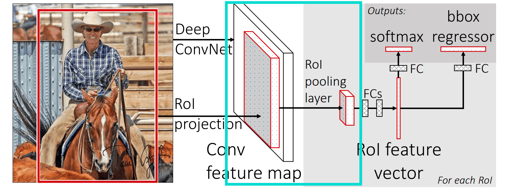
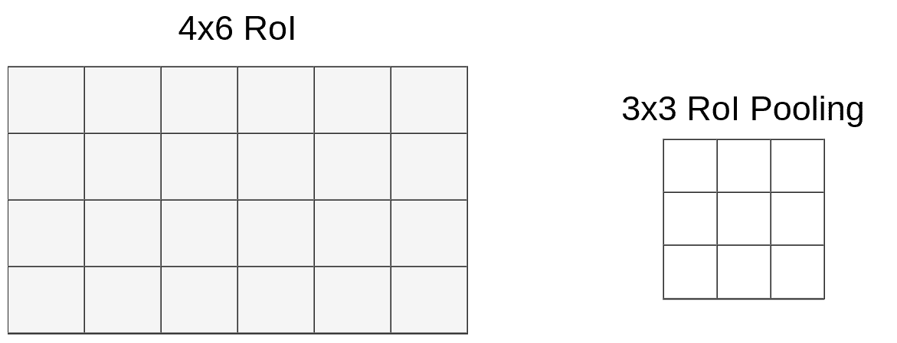
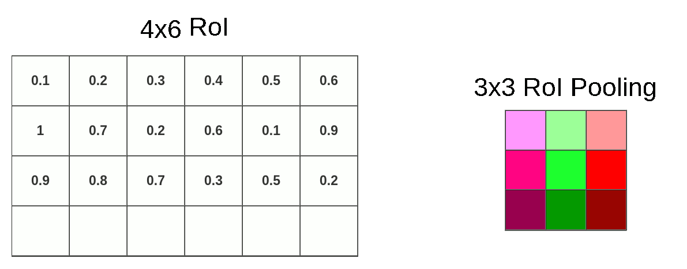
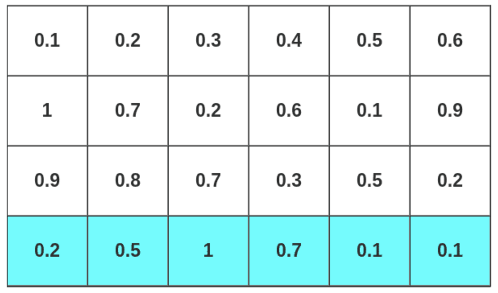

## Region of interest (RoI) pooling layer in Fast RCNN
<hr>

RoI is a proposed region in an original image. RoI pooling is an operation widely used in object detection tasks using convolutional neural networks.
The purpose of RoI pooling operation is to obtain fixed-size (7 x 7) feature maps by performing max pooling operation on the inputs of nonuniform sizes.

The region proposal stage finds all possible places where objects can be located and generates output as a list of bounding boxes. Each bounding box describes the position of an object in the image. One of the popular algorithms of generating region proposal or region of interest is called Region proposal network (RPN). The RPN algorithm is explained in this <a href="">article</a>.

The RoI pooling layer takes two inputs:
1. A fixed-size feature map obtained from a deep convolutional network, for example VGG16.
2. An N x 5 matrix of representing a list of RoIs, where N is a number of RoIs. The first column represents the image index and the remaining four are the coordinates of the top left and bottom right corners of the region.

The following diagram shows the Fast RCNN architecture that contains the highlighted RoI pooling layer.



Figure: Fast R-CNN architecture with RoI pooling layer highlighted. 
Source: https://arxiv.org/pdf/1504.08083.pdf

As shown in the diagram, there is a Fully Connected layer with a fixed size right after the RoI Pooling Layer.
The RPN algorithm generates RoIs of different sizes. For this reason, it is required to convert them into the same size.
This process is done by applying max pooling operation during RoI pooling.

Suppose that we have a mapped RoI of size 4×6×512 and we have to pool them into the size 3×3×512. We are going to choose the size 3×3×512 for our convenience, but the size might be different.



Figure: Mapped RoI and pooling kernel

In the mapped RoI of size 4×6, 6 is divided by 3 and it gives 2, but dividing 4 by 3 left us with 1.33. After rounding up, we have a 1×2 vector. This vector will be used to pool data into 3x3x512 matrix. The following diagram shows the pooling steps. 



Figure: RoI pooling with 1×2 kernel

Note that due to quantization, we will be loosing some data that is shown in the diagram below (last highlighted row).



Figure: Data loss due to quantization

After RoI pooling is done, we have the input of known and fixed size of 3x3x512. So, we can feed it into the FC layers for further processing.


### Implementation of RoI Pooling:


```python
import numpy as np
import tensorflow as tf
from tensorflow.keras.layers import Layer
import os
```

    


```python
class RoIPoolingLayer(Layer):
    def __init__(self, _height_, _width_, **kwargs):
        """
        params:
            _height_: int
            _width_: int
        """
        self._height_ = _height_
        self._width_ = _width_
        
        super(RoIPoolingLayer, self).__init__(**kwargs)


    def call(self, x):
        """ Maps the input tensor of the ROI layer to its output
        this function computes the pooled area
        the element in 0th index in the parameter x is feature map tensor with shape (batch_size, _height_, _width_, n_channels)
        and the element in 1th index in the parameter x is roi bounding box items with shape (batch_size, num_rois, 4)
        each region of interest is defined by four relative coordinates (x_min, y_min, x_max, y_max) between 0 and 1
        """
        def pool_rois(x): 
          return RoIPoolingLayer.rois_pooling(x[0], x[1], self._height_, self._width_)
        
        return tf.map_fn(pool_rois, x, dtype=tf.float32)


    @staticmethod
    def rois_pooling(feature_map, rois, _height_, _width_):
        """ Applies ROI pooling for a single image and varios ROIs
        params:
            feature_map: array
            rois: array
            _height_: int
            _width_: int
        """
        def pool_roi(roi): 
          return RoIPoolingLayer.roi_pooling(feature_map, roi, _height_, _width_)
        
        return tf.map_fn(pool_roi, rois, dtype=tf.float32)
        
    
    @staticmethod
    def roi_pooling(feature_map, roi, _height_, _width_):
        """
        apply roi pooling to a single mapped roi
        params:
            feature_map: array
            roi: array
            _height_: int
            _width_: int

        return:
            pooled_features: array
        """

        # compute roi    
        feature_map_height = int(feature_map.shape[0])
        feature_map_width  = int(feature_map.shape[1])
        
        h_start = tf.cast(feature_map_height * roi[0], 'int32')
        w_start = tf.cast(feature_map_width  * roi[1], 'int32')
        h_end   = tf.cast(feature_map_height * roi[2], 'int32')
        w_end   = tf.cast(feature_map_width  * roi[3], 'int32')
        
        region = feature_map[h_start:h_end, w_start:w_end, :]
        
        # divide the region into non overlapping areas
        region_height = h_end - h_start
        region_width  = w_end - w_start
        h_step = tf.cast( region_height / _height_, 'int32')
        w_step = tf.cast( region_width  / _width_ , 'int32')
        
        areas = [[(
                    i*h_step, 
                    j*w_step, 
                    (i+1)*h_step if i+1 < _height_ else region_height, 
                    (j+1)*w_step if j+1 < _width_ else region_width
                   ) 
                   for j in range(_width_)] 
                  for i in range(_height_)]
        
        # take the maximum of each area and stack the result
        def pool_area(x): 
          return tf.math.reduce_max(region[x[0]:x[2], x[1]:x[3], :], axis=[0,1])
        
        pooled_features = tf.stack([[pool_area(x) for x in row] for row in areas])
        return pooled_features
```

    


#### Ref:

Fast R-CNN https://arxiv.org/pdf/1504.08083.pdf

https://github.com/Jsevillamol

